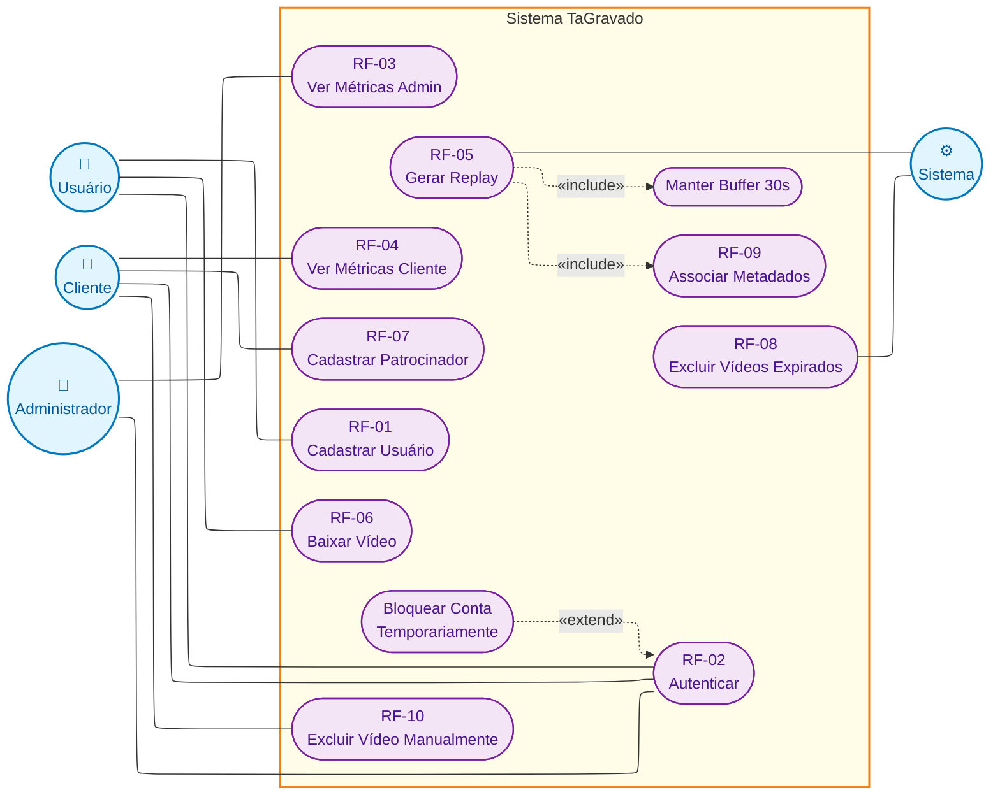

# Diagrama UML de Casos de Uso — TaGravado

**Projeto:** TaGravado — plataforma de captura e download de replays esportivos
**Issue de rastreabilidade:** [R-05 / #13](https://github.com/PI2-2026-2-equipe-03/PI2-2026-2-equipe-03/issues/13)
**Sprint:** 1
**Fonte dos requisitos:** [`relatorio-qualidade-requisitos.md`](./relatorio-qualidade-requisitos.md), [`requisitos-nao-funcionais.md`](./requisitos-nao-funcionais.md), [`fluxo-navegacao.md`](./fluxo-navegacao.md)

## Atores

| Ator | Tipo | Descrição |
|---|---|---|
| **Usuário** | Primário | Jogador / espectador que baixa replays. |
| **Cliente** | Primário | Dono da arena / quadra. Gerencia patrocinadores e conteúdo próprio. |
| **Administrador** | Primário | Administrador global da plataforma. |
| **Sistema** | Secundário | Componentes automáticos: câmera + microcontrolador (botoeira) e scheduler de limpeza. Externo ao software web, dispara casos de uso. |

## Diagrama

Fonte Mermaid (renderizada em PNG com layout ELK):

## Relações modeladas

### `«include»` (dependência obrigatória)
- **RF-05 Gerar Replay** inclui **Manter Buffer 30s** — o clip só existe porque o backend mantém um buffer contínuo dos últimos 30s por câmera.
- **RF-05 Gerar Replay** inclui **RF-09 Associar Metadados** — todo replay é persistido com quadra, data e hora no mesmo commit de banco.

### `«extend»` (comportamento opcional / excepcional)
- **Bloquear Conta Temporariamente** estende **RF-02 Autenticar** — ativado apenas após 5 tentativas incorretas (RNF-04), com bloqueio de 15 min.

## Cobertura dos requisitos

**Casos de uso essenciais (mínimo 5 exigido pela issue #13):** RF-01, RF-02, RF-05, RF-06, RF-09.

**Complementares incluídos** (info suficiente para modelar): RF-03, RF-04, RF-07, RF-08, RF-10.

**Não modelados / fora de escopo:**
- Módulo de Reserva de Horários — 2ª parte do projeto (fora da Sprint 1).
- `RNF-01` a `RNF-05` — refletidos como extensões/observações quando impactam UC (ex.: RNF-04 → Bloquear Conta), não como UCs próprios.

## Pontos abertos para refinamento

Levantados pelos hubs-filhos (pi2-backend e pi2-frontend) durante o dispatch:

1. **RF-10 (Exclusão manual) — ator ambíguo.** QA e backend indicam texto original conflitante ("cliente com sua conta de administrador"). Diagrama atual modela como **Cliente**; se a decisão for Admin, mover a associação.
2. **RF-08 — física vs. soft delete.** Recomendação do backend: soft delete (`deleted_at`) + purge físico posterior, para RF-06 tratar graciosamente vídeos expirados.
3. **RF-01 — escopo do ator.** README do pi2-backend menciona apenas "administradores da arena"; RF-01 exige cadastro de usuário final. Diagrama reforça Usuário como ator.
4. **RF-03/RF-04 — métricas vagas.** Precisam de refinamento com o cliente para virarem UCs testáveis.

## Referências

- Repo docs: [PI2-2026-2-equipe-03](https://github.com/PI2-2026-2-equipe-03/PI2-2026-2-equipe-03)
- Repo backend: [pi2-backend](https://github.com/PI2-2026-2-equipe-03/pi2-backend)
- Repo frontend: [pi2-frontend](https://github.com/PI2-2026-2-equipe-03/pi2-frontend)
- Figma (protótipo alta fidelidade — em construção): <https://www.figma.com/design/zLz9JwG8iKX8twcxCNoUO2/TaGravado>
