# Mapeamento de Telas aos Requisitos Funcionais

Este documento apresenta o de-para entre as telas do protótipo de alta fidelidade do sistema TaGravado e os respectivos Requisitos Funcionais (RFs).

---

## RF-01 — Cadastro de usuário

### Tela: Criar conta

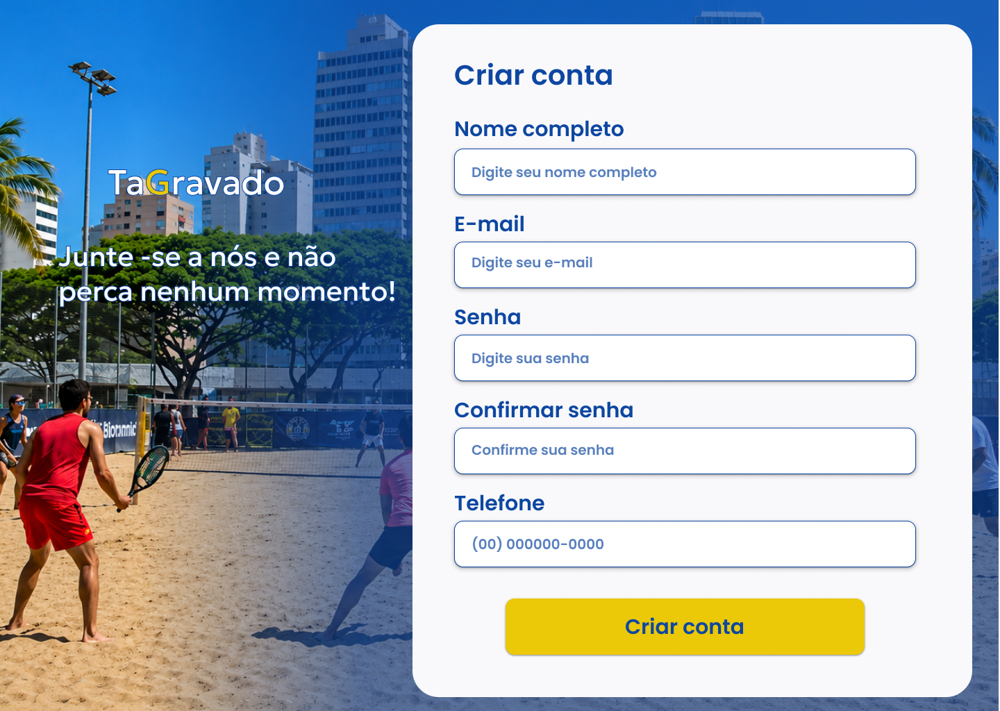

A tela permite que novos usuários realizem seu cadastro na plataforma.

---

## RF-02 — Login de usuário

### Tela: Login

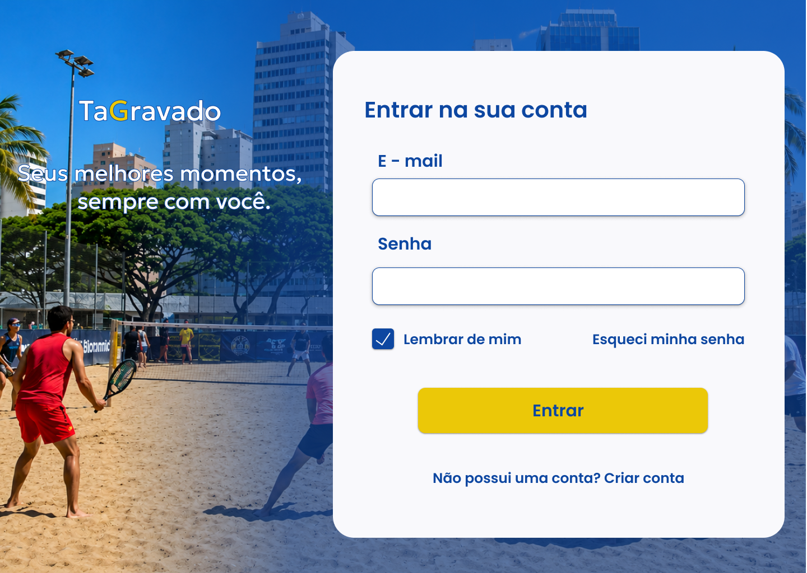

A tela permite que usuários cadastrados realizem login para acessar as funcionalidades do sistema.

---

## RF-03 — Métricas para o administrador

### Tela: Painel administrativo

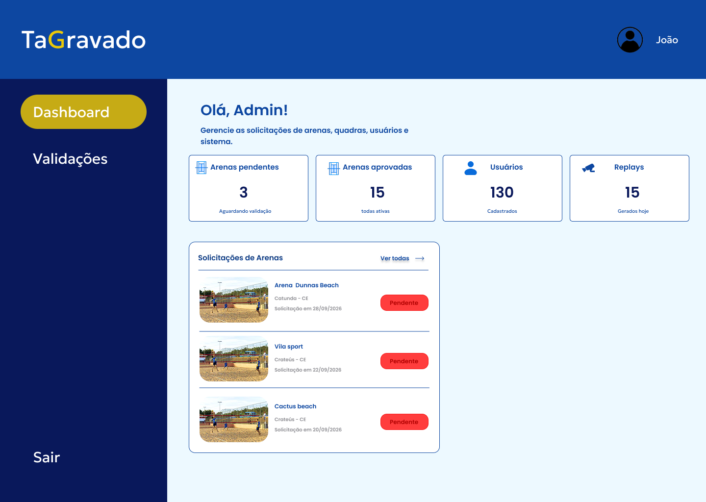

A tela apresenta informações e métricas destinadas ao acompanhamento do sistema pelos desenvolvedores/administradores.

---

## RF-04 — Métricas para o cliente

### Tela: Perfil / área do cliente

A tela representa a área de acesso do cliente/organizador às funcionalidades relacionadas à sua conta.

---

## RF-05 — Gravar vídeo

### Tela: Não possui tela específica

A gravação ocorre por meio do acionamento do botão físico da quadra e do armazenamento dos últimos 30 segundos pela câmera. Dessa forma, o requisito não possui uma tela específica no protótipo.

---

## RF-06 — Baixar vídeo

### Tela: Início

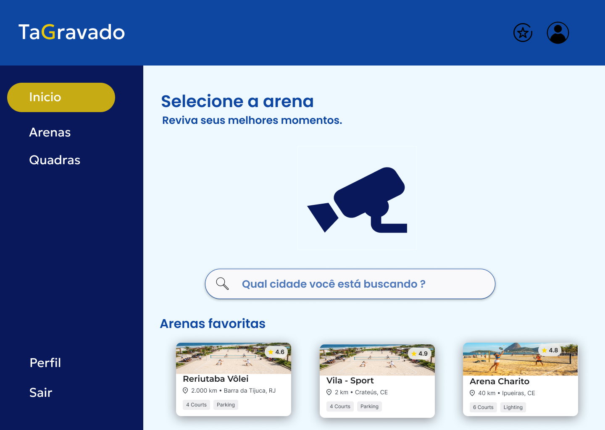

A tela permite iniciar a busca por uma arena e pelos vídeos disponíveis.

### Tela: Seleção de arena

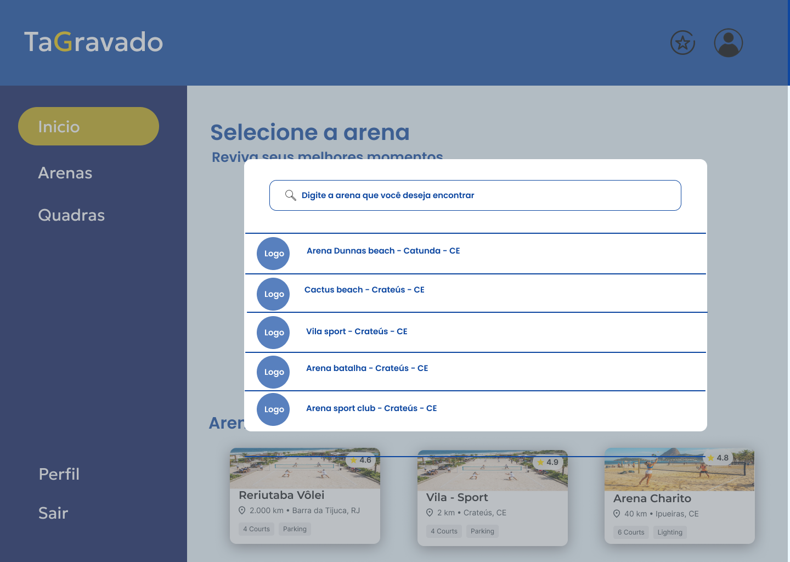

Permite selecionar a arena desejada para realizar a busca pelos vídeos.

### Tela: Quadras

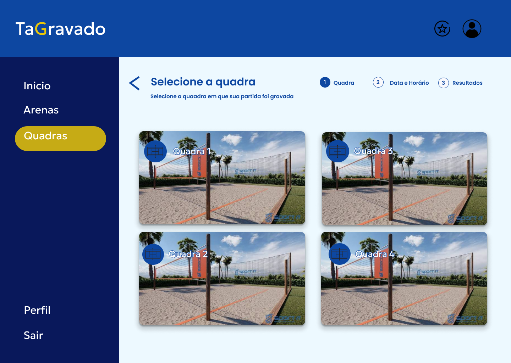

Permite selecionar a quadra desejada para realizar a busca pelo vídeo.

### Tela: Horário e data

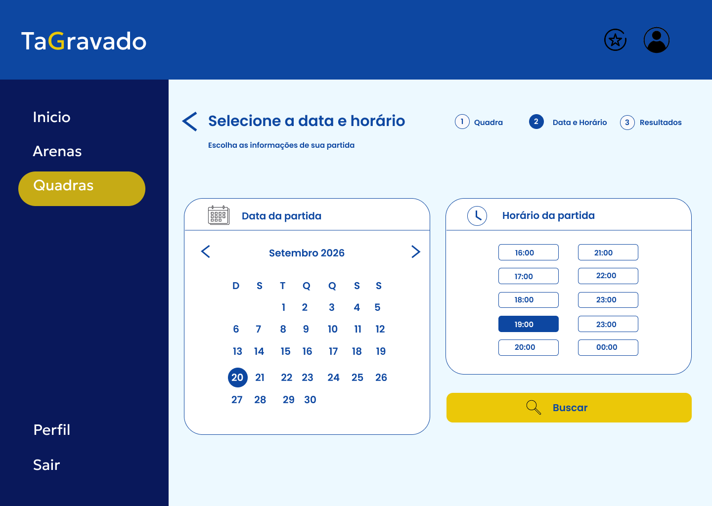

Permite selecionar a data e o horário para localizar o replay.

### Tela: Resultados

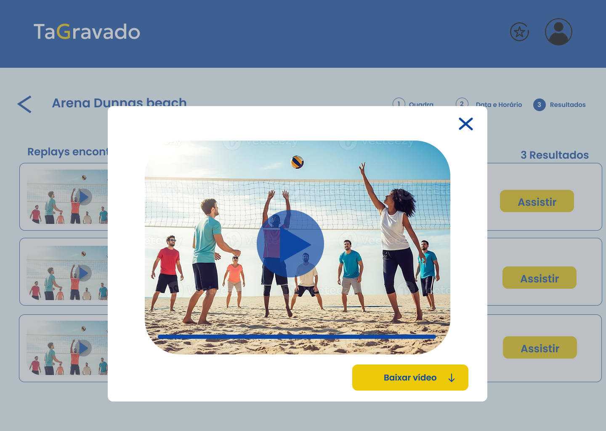

Apresenta os vídeos encontrados, permitindo sua visualização e download.

---

## RF-07 — Cadastrar patrocinadores

### Tela: Cadastrar patrocinador

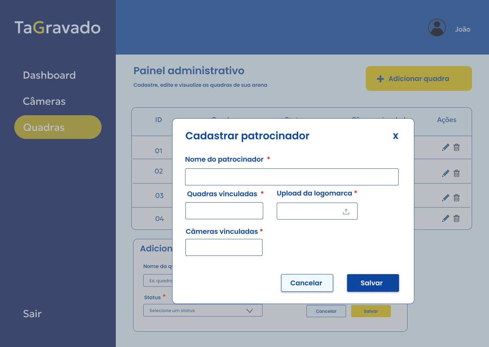

Permite ao cliente cadastrar patrocinadores relacionados às suas quadras.

---

## RF-08 — Tempo de disponibilidade dos vídeos

### Tela: Resultados

A tela de resultados apresenta a informação referente ao período de disponibilidade dos vídeos antes da exclusão automática.

---

## RF-09 — Associar informações ao replay

### Tela: Resultados

A tela apresenta informações associadas aos replays, como quadra, data e horário.

---

## RF-10 — Exclusão de vídeos

### Tela: Exclusão manual de vídeo

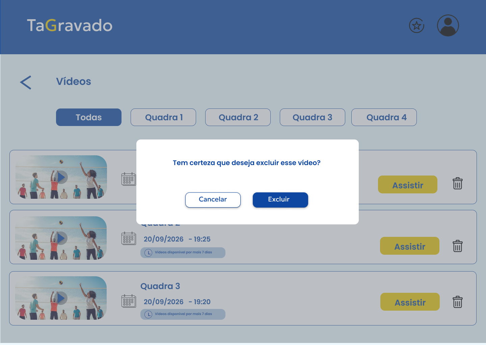

Permite ao cliente ou administrador realizar a exclusão manual de um vídeo.

---

## RF-11 — Solicitação de recuperação de senha

### Tela: Recuperar senha

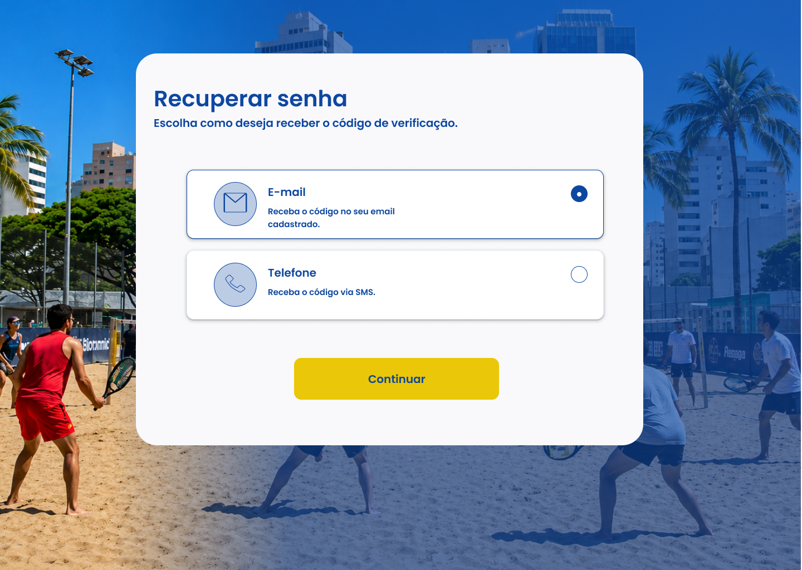

Permite ao usuário iniciar o processo de recuperação ou alteração da senha.

---

## RF-12 — Solicitação de cadastro como gestor de quadra

### Tela: Perfil

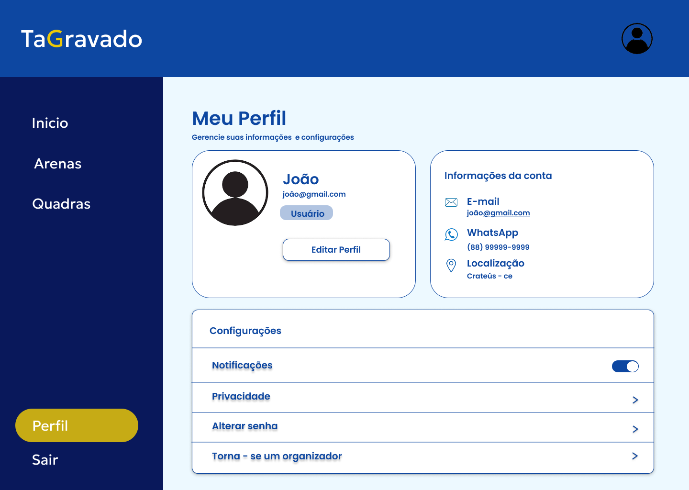

A partir do perfil, o usuário pode acessar a opção para solicitar cadastro como organizador/gestor de quadra.

### Tela: Solicitação

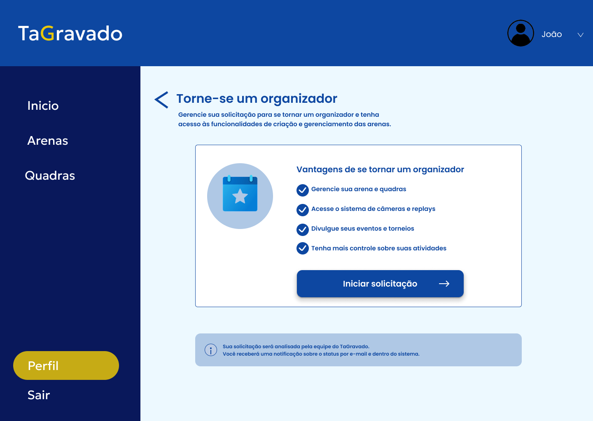

Permite ao usuário realizar a solicitação para se tornar organizador/gestor de quadra.

### Tela: Validação

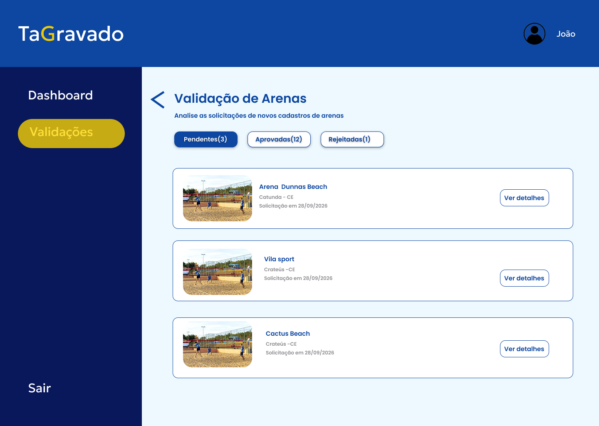

Permite aos desenvolvedores/administradores do sistema analisar a solicitação e aprovar ou rejeitar o cadastro como organizador.

---

## Observações

- O RF-05 não possui uma tela específica, pois a gravação é realizada por meio do botão físico da quadra e da câmera.
- O RF-06 é representado por várias telas que compõem o fluxo de busca e acesso aos vídeos.
- Os RF-08 e RF-09 são representados pelas informações apresentadas na tela de resultados.
- O RF-12 é representado pelas telas de perfil e solicitação realizadas pelo usuário, além da tela de validação utilizada pelos desenvolvedores/administradores para aprovação ou rejeição da solicitação.