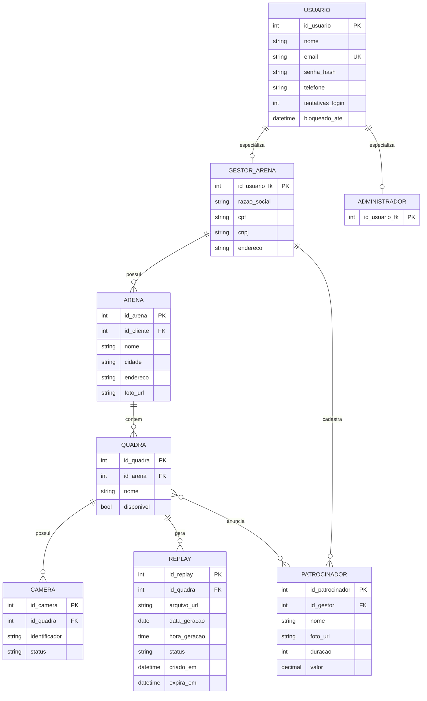
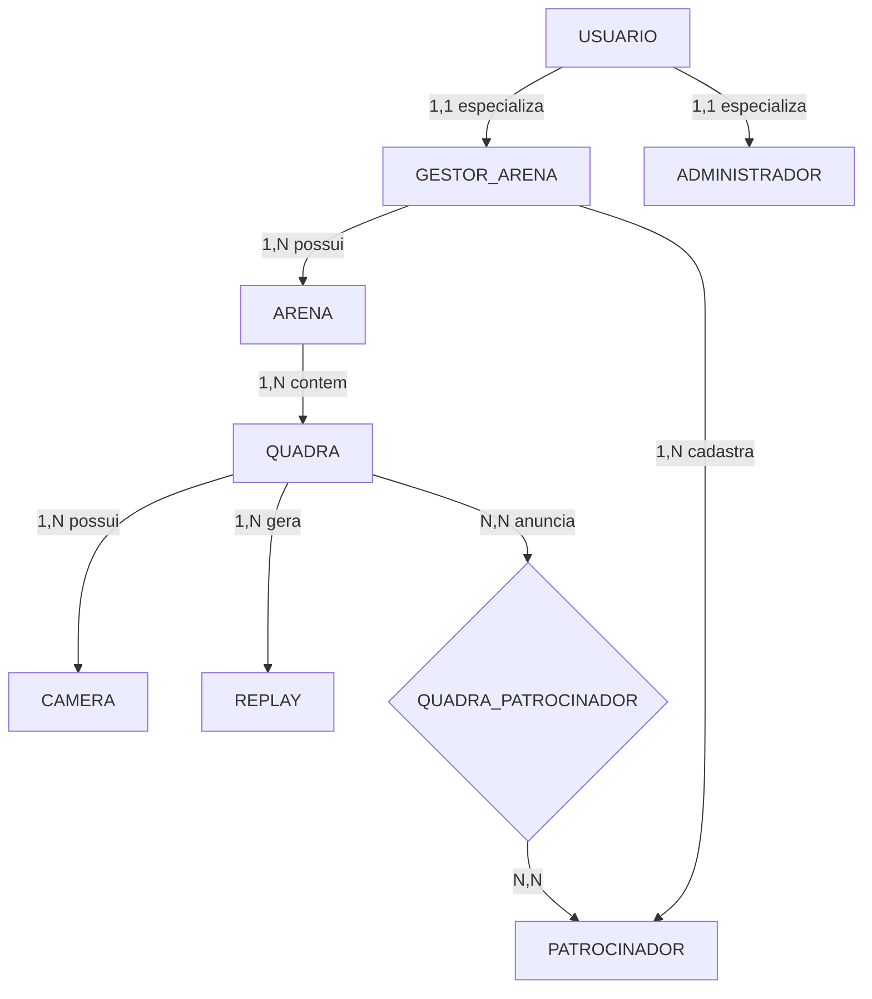

# Modelo Entidade-Relacionamento (MER) — TaGravado

**Projeto:** TaGravado, plataforma de captura e download de replays esportivos
**Sprint:** 1
**Fonte dos requisitos:** [`requisitos_funcionais.md`](./requisitos_funcionais.md), [`casos-de-uso.md`](./casos-de-uso.md), [`diagrama-casos-de-uso.md`](./diagrama-casos-de-uso.md)

## Entidades

| Entidade | Descrição |
|---|---|
| **usuario** | Superclasse: conta com dados comuns a todos os perfis. |
| **gestor_arena** | Especialização de usuario: dono/gestor de arena (Cliente). |
| **administrador** | Especialização de usuario: administrador global da plataforma. |
| **arena** | Estabelecimento esportivo, pertencente a um gestor_arena. |
| **quadra** | Quadra dentro de uma arena. |
| **camera** | Câmera vinculada a uma quadra, responsável pelo buffer de gravação. |
| **replay** | Vídeo gerado a partir do acionamento da botoeira, associado a quadra/data/hora. |
| **patrocinador** | Patrocinador cadastrado por um gestor_arena. |
| **quadra_patrocinador** | Associativa N:N entre quadra e patrocinador. |

> Especialização **parcial e disjunta**: nem todo usuario é gestor_arena ou administrador (jogador/espectador comum não tem subtipo), e um usuario não pode ser as duas coisas ao mesmo tempo.

## Diagrama

### Versão flowchart
 

## Atributos, chaves e regras

### usuario (superclasse)
| Atributo | Tipo | Chave | Observação |
|---|---|---|---|
| id_usuario | int | PK | |
| nome | string | | |
| email | string | UK | RF-01, RF-02 |
| senha_hash | string | | nunca armazenar em texto plano |
| telefone | string | | |
| tentativas_login | int | | RNF-04 — bloqueio após 5 tentativas |
| bloqueado_ate | datetime | | RNF-04 — bloqueio de 15 min |
 
### gestor_arena (especialização)
| Atributo | Tipo | Chave | Observação |
|---|---|---|---|
| id_usuario | int | PK, FK → usuario | herda de usuario |
| razao_social | string | | |
| cpf | string | | |
| cnpj | string | | |
| endereco | string | | |
 
### administrador (especialização)
| Atributo | Tipo | Chave | Observação |
|---|---|---|---|
| id_usuario | int | PK, FK → usuario | herda de usuario, sem atributos próprios até o momento |

### arena
| Atributo | Tipo | Chave | Observação |
|---|---|---|---|
| id_arena | int | PK | |
| id_cliente | int | FK → usuario | dono da arena |
| nome | string | | |
| cidade | string | | usada na busca (fluxo de navegação) |
| endereco | string | | |
| foto_url | string | | completa o perfil da arena |

### quadra
| Atributo | Tipo | Chave | Observação |
|---|---|---|---|
| id_quadra | int | PK | |
| id_arena | int | FK → arena | |
| nome | string | | |
| disponivel | bool | | RF-06, fluxo alternativo "quadra indisponível" |

### camera
| Atributo | Tipo | Chave | Observação |
|---|---|---|---|
| id_camera | int | PK | |
| id_quadra | int | FK → quadra | |
| identificador | string | | |
| status | string | | |

### replay
| Atributo | Tipo | Chave | Observação |
|---|---|---|---|
| id_replay | int | PK | |
| id_quadra | int | FK → quadra | RF-09 |
| arquivo_url | string | | |
| data_geracao | date | | RF-09 |
| hora_geracao | time | | RF-09 |
| status | enum | | `pendente`, `disponivel`, `excluido` — RF-09 (falha), RF-10 (exclusão manual) |
| criado_em | datetime | | |
| expira_em | datetime | | RF-08 — `criado_em` + 7 dias |

### patrocinador
| Atributo | Tipo | Chave | Observação |
|---|---|---|---|
| id_patrocinador | int | PK | |
| id_gestor | int | FK → gestor_arena | quem cadastrou o patrocinador |
| nome | string | | RF-07 — unicidade validada por quadra |
| foto_url | string | | |
| duracao | int | | |
| valor | decimal | | |

### quadra_patrocinador
| Atributo | Tipo | Chave | Observação |
|---|---|---|---|
| id_quadra | int | PK, FK → quadra | |
| id_patrocinador | int | PK, FK → patrocinador | RF-07 — limite de patrocinadores por quadra controlado na aplicação |

## Cardinalidades

| Relacionamento | Cardinalidade |
|---|---|
| usuario — gestor_arena | 1:1 (parcial, disjunta) |
| usuario — administrador | 1:1 (parcial, disjunta) |
| gestor_arena — arena | 1:N |
| gestor_arena — patrocinador | 1:N |
| arena — quadra | 1:N |
| quadra — camera | 1:N |
| quadra — replay | 1:N |
| quadra — patrocinador | N:N (via quadra_patrocinador) |

## Pontos em aberto

1. **RF-10 (exclusão de replay)** — modelo não registra quem excluiu (Cliente ou Administrador). Se necessário rastrear, adicionar `excluido_por FK → usuario` em `replay`.
2. **RF-08 (expiração)** — `status = excluido` cobre tanto soft delete automático quanto manual; purge físico do arquivo é decisão de infraestrutura, fora do escopo do MER.

## Referências

- [`requisitos_funcionais.md`](./requisitos_funcionais.md)
- [`casos-de-uso.md`](./casos-de-uso.md)
- [`diagrama-casos-de-uso.md`](./diagrama-casos-de-uso.md)